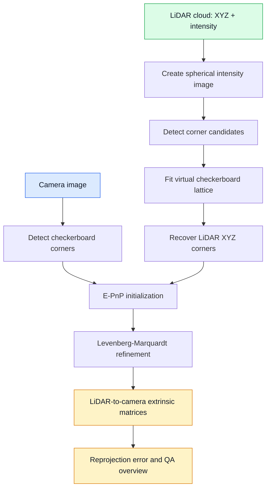
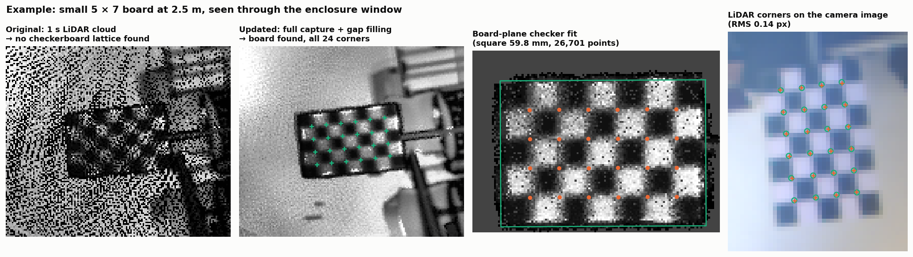

# Single-Shot LiDAR-Camera Extrinsic Calibration

Python implementation of the method in **“An Automated Single-Shot LiDAR and Camera Extrinsic Calibration Method Using Image Processing”** by Pasindu Ranasinghe, Dibyayan Patra, Bikram Banerjee, and Simit Raval (IGARSS 2025).

[Read the paper on IEEE Xplore](https://ieeexplore.ieee.org/document/11242429)

This is a true single-shot calibrator: one stationary capture produces one LiDAR-to-camera extrinsic transform. There are no dataset scenarios or batch-pairing rules.

> This repository is a research reproduction based on the published method description, not an official reference implementation.

## Method



The pipeline automatically tests the valid checkerboard orientations, chooses the lowest-error physical solution, refines it, evaluates its quality, and creates one visual verification image.

## Required input

Choose one of these single-capture inputs:

1. One camera image and one corresponding PCD point cloud; or
2. One ROS1 bag or ROS2 bag directory containing the camera and point-cloud topics.

You also need:

- calibrated camera matrix and distortion coefficients;
- a flat checkerboard fully visible to both sensors;
- checkerboard inner-corner count, written as `[columns, rows]`;
- PCD fields `x`, `y`, `z`, and preferably `intensity`.

Camera intrinsics must already be known. The physical cell size is optional because LiDAR XYZ points already provide metric scale. For example, a checkerboard containing 7 x 10 squares has 6 x 9 inner corners.

## Installation

```bash
python -m venv .venv
# Windows: .venv\Scripts\activate
# Linux/macOS: source .venv/bin/activate
pip install -r requirements.txt
```

## Configuration

Edit the short, commented [`config.yaml`](config.yaml). Normally only change the input paths, camera intrinsics, checkerboard dimensions, and LiDAR axes/FOV.

### Image and PCD

```yaml
input:
  image: data/image.png
  pointcloud: data/cloud.pcd
```

The filenames do not need to match. They only need to represent the same stationary capture.

### One ROS bag

Comment out or ignore `image` and `pointcloud`, then set:

```yaml
input:
  bag: data/capture.bag       # ROS1 .bag or ROS2 bag directory
  image_topic: /camera/image_raw
  pointcloud_topic: /livox/lidar
```

The bag reader selects the stationary image and merges the LiDAR clouds of the capture; the checkerboard and sensors must not move during it. No ROS installation is needed (see [Updates](#updates)).

### Camera and target

```yaml
camera:
  model: fisheye             # fisheye or pinhole
  camera_matrix:
    - [fx, 0.0, cx]
    - [0.0, fy, cy]
    - [0.0, 0.0, 1.0]
  distortion: [k1, k2, k3, k4]

checkerboard:
  inner_corners: [6, 9]
  square_size_mm: 41.0       # optional metadata
```

For a pinhole camera, use the distortion coefficients produced by its intrinsic calibration.

## Run

```bash
python calibrate.py --config config.yaml
```

No manual point selection or initial extrinsic estimate is required.

## Automatic defaults

Do not change these unless the overview shows a detection problem:

| Parameter | Default | Purpose |
|---|---:|---|
| spherical intensity image | 600 x 600 px | LiDAR image used by the paper method |
| accepted range | 0.35-20 m | Reject invalid calibration returns |
| camera upscaling | 1-6x | Detect small targets |
| corner candidates | 1800 maximum | Bound the lattice search |
| lattice hypotheses | 5000 | Automatic checkerboard search |
| lattice tolerance | 0.38 cell | Support incomplete LiDAR returns |
| minimum LiDAR corners | 18 | Minimum accepted correspondences |
| point recovery radius | 2.5 px | Recover XYZ from spherical pixels |
| bag synchronization | 0.05 s | Maximum nearest timestamp difference |
| cloud accumulation | 1.0 s | Stationary LiDAR merge interval |
| LM evaluations | 300 | Nonlinear refinement limit |
| quality threshold | 3.0 px | Maximum automatic PASS RMS |

Advanced values may be overridden by adding the matching `detection`, `optimization`, `quality`, or `spherical_projection` field to YAML.

## Output

One run creates only two files in `outputs/`:

- `calibration.json`: LiDAR-to-camera and camera-to-LiDAR 4 x 4 matrices, rotation, translation in metres, E-PnP error, refined error, per-corner errors, runtime, and automatic `pass`/`review` status;
- `calibration_overview.png`: camera checkerboard detection, LiDAR lattice detection, original image, and LiDAR-to-image projection in one QA image.

The transform follows column-vector notation:

```text
p_camera = R_lidar_to_camera * p_lidar + t_lidar_to_camera
```

A result passes automatically when LM improves the E-PnP estimate and the final RMS is at most 3 px. Always inspect `calibration_overview.png`: the LiDAR lattice must cover the physical board and projected LiDAR structures must align with the camera image.

## Updates

The method above is unchanged: one stationary capture, given camera intrinsics, spherical intensity image, lattice, E-PnP and LM. The following additions make each step more reliable. They are on by default; `robust: {enabled: false}` runs the published pipeline exactly.

| Step | Published | Updated |
|---|---|---|
| Bag input | Needs ROS | Pure-Python reader (`rosbags`), no ROS |
| Camera image | Nearest frame | Median of all stationary frames |
| Camera corners | Scaled back by `x/s` | Pixel-centre mapping `(x+0.5)/s-0.5`; contrast fallback for glare |
| LiDAR cloud | 1 s | Whole stationary capture, board-motion check |
| Intensity image | Scan gaps kept | Small gaps filled |
| Board search | Whole image | Also board-sized planar range segments |
| LiDAR corners | Median XYZ at lattice pixels | Lattice refined by a board-plane checker fit using all board points |
| Orientation | Lowest RMS of 4 orderings | Mirrored poses rejected; symmetric boards resolved with a rough mounting rotation |
| Refinement | LM | LM + robust (Huber) loss |
| Quality check | RMS ≤ 3 px | Also board contrast, coverage, square size, motion and pose uncertainty |

Example: a small board behind an enclosure window. The 1 s cloud is too sparse for the lattice search; the updated steps recover all 24 corners, which land on the camera corners.



Notes:

- **Symmetric boards** (odd × odd squares, e.g. 5 × 7) have two equally good solutions 180° apart. Set `robust.approx_rotation_lidar_to_camera` to a rough rotation (±45°), or use an even × odd board such as 7 × 10.
- **Extra outputs:** `calibration.json` adds `review_reasons`, `uncertainty` (deg / mm) and `lidar_board` diagnostics; the overview has six panels, including the board-plane fit and a corner check.
- All update settings are listed in `single_shot_calib/config.py` under `robust`.

## Paper

P. Ranasinghe, D. Patra, B. Banerjee, and S. Raval, “An Automated Single-Shot LiDAR and Camera Extrinsic Calibration Method Using Image Processing,” *2025 IEEE International Geoscience and Remote Sensing Symposium (IGARSS)*, pp. 5099-5102, 2025.

- DOI: [10.1109/IGARSS55030.2025.11242429](https://doi.org/10.1109/IGARSS55030.2025.11242429)
- [IEEE Xplore paper](https://ieeexplore.ieee.org/document/11242429)

## Results

- Average final reprojection error: **1.060 px**
- Runtime: **under 10 seconds**
- E-PnP initial error: **1.600 px**
- Error after refinement: **1.060 px**

## Citation

GitHub’s **Cite this repository** control reads [`CITATION.cff`](https://github.com/maninka123/single-shot-lidar-camera-calibration/blob/main/CITATION.cff). A ready-to-copy paper entry is also provided in [`CITATION.bib`](https://github.com/maninka123/single-shot-lidar-camera-calibration/blob/main/CITATION.bib).

```bibtex
@inproceedings{ranasinghe2025automated,
  author    = {Ranasinghe, Pasindu and Patra, Dibyayan and Banerjee, Bikram and Raval, Simit},
  title     = {An Automated Single-Shot {LiDAR} and Camera Extrinsic Calibration Method Using Image Processing},
  booktitle = {2025 IEEE International Geoscience and Remote Sensing Symposium (IGARSS)},
  pages     = {5099--5102},
  year      = {2025},
  doi       = {10.1109/IGARSS55030.2025.11242429}
}
```

## License

MIT. See [`LICENSE`](LICENSE).
