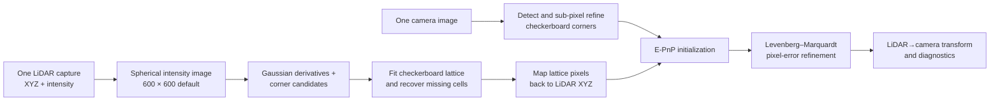

# Single-Shot LiDAR–Camera Extrinsic Calibration

An independent Python implementation of the method described in **“An Automated Single-Shot LiDAR and Camera Extrinsic Calibration Method Using Image Processing”** by Pasindu Ranasinghe, Dibyayan Patra, Bikram Banerjee, and Simit Raval (IGARSS 2025).

This is one generic calibration method. It has no “raw”, “enclosure”, or scenario-specific code. Each image–point-cloud pair is calibrated independently.

> This repository is a research reproduction based on the published method description, not the authors’ official reference implementation.

## Method



The implementation follows the paper’s main stages: spherical projection of LiDAR intensity, image-processing-based lattice extraction, a virtual checkerboard lattice with nearest-neighbour recovery, E-PnP initialization, and Levenberg–Marquardt refinement. Four valid checkerboard orderings are tested automatically.

## What you need

- A calibrated camera matrix and distortion coefficients. Camera intrinsics must be known before extrinsic calibration.
- A flat checkerboard visible completely in both the camera and LiDAR intensity data.
- One camera image and its corresponding point cloud for each stationary capture.
- Point clouds in PCD format with `x y z` and preferably `intensity`, or a ROS1/ROS2 bag containing `sensor_msgs/Image` (or `CompressedImage`) and `sensor_msgs/PointCloud2`.
- Python 3.10 or newer. ROS bag mode must run in a Python environment belonging to the sourced ROS distribution.

The physical checkerboard cell size is optional because the LiDAR supplies metric 3D points. `square_size_mm` is retained as metadata. `inner_corners` is required: a board with 7 × 10 squares has 6 × 9 inner corners.

## Install and run

```bash
python -m venv .venv
# Windows: .venv\Scripts\activate
# Linux/macOS: source .venv/bin/activate
pip install -r requirements.txt
python calibrate.py --config config.yaml
```

Copy `config.yaml` if you want a private configuration, for example `config.local.yaml`; local configs are ignored by Git.

### Input layouts

Use exactly one of these layouts in `config.yaml`. Keep `mode: auto`; the pipeline selects the correct reader from the fields you provide. Explicit modes remain available if needed.

**One direct pair**

```yaml
input:
  mode: auto
  image: data/image.png
  pointcloud: data/cloud.pcd
```

**One pair per subfolder**

```text
data/pairs/
├── capture_01/  (one image + one .pcd)
└── capture_02/  (one image + one .pcd)
```

```yaml
input:
  mode: auto
  pairs_dir: data/pairs
```

**Matching names in separate folders**

`data/images/pose_01.png` is paired with `data/pointclouds/pose_01.pcd`.

```yaml
input:
  mode: auto
  image_dir: data/images
  pointcloud_dir: data/pointclouds
```

**ROS1 or ROS2 bags**

Each bag is treated as a separate stationary capture. The closest camera frame is selected and point clouds in a 1-second window are merged by default.

```yaml
input:
  mode: auto
  bags: [data/pose_01.bag, data/pose_02.bag]
  image_topic: /camera/image_raw
  pointcloud_topic: /livox/lidar
```

For ROS2, each item in `bags` is normally the bag directory containing `metadata.yaml` and `.db3`/`.mcap` storage.

## Simple configuration

The provided `config.yaml` is intentionally short and commented. Normally change only:

1. input mode and paths/topics;
2. camera model, matrix, and distortion;
3. checkerboard inner-corner count;
4. LiDAR field of view and axis directions if your frame differs.

Built-in defaults should not be changed unless diagnostics show a problem:

| Parameter | Default | Purpose |
|---|---:|---|
| spherical image | 600 × 600 px | Paper’s LiDAR intensity-image resolution |
| range | 0.35–20 m | Reject implausible calibration returns |
| camera upscale factors | 1–6× | Find small checkerboards robustly |
| maximum candidates | 1800 | Limit derivative-corner search |
| lattice trials | 5000 | Random lattice hypotheses |
| lattice tolerance | 0.38 cell | Candidate-to-grid matching tolerance |
| minimum LiDAR corners | 18 | Minimum correspondences accepted |
| recovery radius | 2.5 px | Map intensity-image corners back to XYZ |
| bag sync tolerance | 0.05 s | Maximum image/cloud timestamp difference |
| bag merge window | 1.0 s | Accumulated LiDAR interval while stationary |
| optimizer | 300 evaluations | E-PnP followed by LM |

Advanced values can be overridden by adding their matching `detection`, `optimization`, or `spherical_projection` key to YAML.

## Outputs and validation

Every capture receives its own `outputs/<capture>/` directory with only two files:

- `calibration.json`: both 4 × 4 transforms, rotation, translation in metres, E-PnP and refined reprojection errors, and per-corner errors;
- `calibration_overview.png`: one combined QA image containing the camera detection, LiDAR intensity lattice, and LiDAR-to-camera projection;
The root `outputs/summary.json` collects all capture results. The JSON includes an automatic `pass`/`review` quality status; the default pass rule is refined RMS ≤ 3 px and improvement over E-PnP. Always inspect the overview before accepting a transform.

Generated outputs and input datasets are intentionally ignored by Git. Validate a calibration by checking that projected LiDAR edges align with camera edges, the lattice covers the physical checkerboard, most points have positive camera depth, and the refined RMS error improves on E-PnP. A low scalar error alone is not sufficient if the wrong lattice was selected.

The output transform uses column-vector notation:

```text
p_camera = R_lidar_to_camera · p_lidar + t_lidar_to_camera
```

## Paper and reported results

- P. Ranasinghe, D. Patra, B. Banerjee, and S. Raval, “An Automated Single-Shot LiDAR and Camera Extrinsic Calibration Method Using Image Processing,” *2025 IEEE International Geoscience and Remote Sensing Symposium (IGARSS)*, pp. 5099–5102, 2025.
- DOI: [10.1109/IGARSS55030.2025.11242429](https://doi.org/10.1109/IGARSS55030.2025.11242429)
- [IEEE Xplore record](https://ieeexplore.ieee.org/document/11242429) · [IGARSS program entry](https://www.2025.ieeeigarss.org/view_paper.php?PaperNum=6165&SessionID=1294)

The paper reports an average final reprojection error of **1.060 px** and runtime under **10 s** for its experiment. Its E-PnP result improved from **1.600 px** initially to **1.060 px** after refinement. These are paper-reported results, not bundled output from this repository; performance will depend on sensors, target visibility, synchronization, and configuration.

## Citation

GitHub’s **Cite this repository** control reads [`CITATION.cff`](CITATION.cff). A ready-to-copy paper entry is also provided in [`CITATION.bib`](CITATION.bib).

## License

MIT. See [`LICENSE`](LICENSE).
