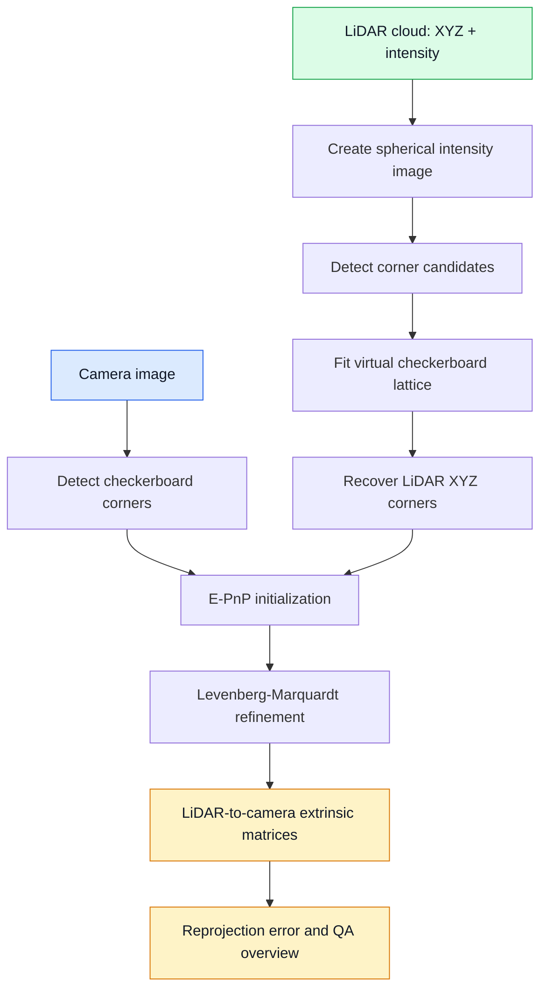
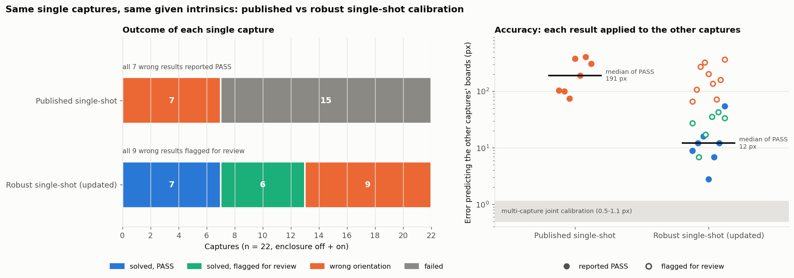

# Single-Shot LiDAR-Camera Extrinsic Calibration

Python implementation of the method in **“An Automated Single-Shot LiDAR and Camera Extrinsic Calibration Method Using Image Processing”** by Pasindu Ranasinghe, Dibyayan Patra, Bikram Banerjee, and Simit Raval (IGARSS 2025).

[Read the paper on IEEE Xplore](https://ieeexplore.ieee.org/document/11242429)

This is a true single-shot calibrator: one stationary capture produces one LiDAR-to-camera extrinsic transform. There are no dataset scenarios or batch-pairing rules.

> This repository is a research reproduction based on the published method description, not an official reference implementation.

## Method



The pipeline automatically tests the valid checkerboard orientations, chooses the lowest-error physical solution, refines it, evaluates its quality, and creates one visual verification image.

## Robust mode (updated method)

Robust mode keeps the paper's single-shot core and makes each stage harder to break. It is **on by default**. Set `robust: {enabled: false}` to run the original published pipeline exactly as before.

What does **not** change:

- One stationary capture in, one LiDAR-to-camera extrinsic out.
- Camera intrinsics are **given** and never re-estimated.
- The core is still the spherical intensity image → derivative corners → checkerboard lattice → E-PnP → LM.

### What was updated

| Stage | Published method | Robust mode update | Why it is more robust |
|---|---|---|---|
| Bag input | Needs a ROS installation | Pure-Python `rosbags` reader (ROS1 `.bag` or ROS2) | Runs on Windows/macOS without ROS |
| Camera image | The single frame nearest the cloud time | Median of all frames of the stationary capture; frames that moved or changed exposure are dropped | Removes sensor noise; steadier corners in glare |
| Camera corners | Upscaled corners divided by the scale factor | Pixel-centre mapping `(x+0.5)/s − 0.5`, plus a CLAHE fallback | Removes a bias of up to 0.4 px; finds boards in low contrast |
| LiDAR cloud | 1 s merge window | Whole stationary capture (e.g. 10 s), with a check that the board did not move | A non-repetitive scan needs time to cover a small board densely |
| LiDAR intensity image | Scan gaps left empty | Small gaps filled before corner detection | Gaps no longer create false corners |
| Board search | Lattice RANSAC over the whole image | Also tries planar, board-sized range segments bounded by depth edges (thin bridges like a hanging pole are cut) | Clutter elsewhere in the scene cannot win the lattice search |
| LiDAR 3D corners | Median XYZ of points near each lattice pixel; only matched corners | Paper lattice as the start, then a **board-plane pattern fit**: plane from the dark (unsaturated) cells, every point moved along its beam onto the plane, ideal black/white pattern fitted to all board points | All corners, every time; range noise and bright-cell range walk no longer shift corners; square size checked |
| Orientation choice | Lowest-RMS of 4 orderings | Mirrored orderings rejected (the board must face both sensors). A symmetric board (odd × odd squares) is detected, and resolved by an optional rough mounting rotation | No more 90°/180° wrong answers that still report PASS |
| Refinement | LM | LM, then a robust (Huber) loss | Less sensitive to one bad corner |
| Quality status | PASS if RMS ≤ 3 px | Also checks cell contrast, cell coverage, square size, board motion and **pose uncertainty**; any failure → REVIEW with a reason | A sub-pixel RMS on a wrong or weak solution is no longer reported as PASS |
| Output | Extrinsic + RMS | Also rotation/translation uncertainty, review reasons, alternative solutions, LiDAR board diagnostics, a 6-panel overview | Easy to judge whether one capture is enough |

### Before and after on real data

These are 22 real captures (Livox Avia + fisheye camera, 5 × 7 board, enclosure off and on). Each capture was calibrated on its own, with the same given intrinsics, by the published pipeline and by robust mode. The "accuracy" panel applies each single-shot result to the *other* captures' boards, which that result never saw.



**Published pipeline:**

- 15 of 22 captures failed; the LiDAR lattice was not found in a 1 s cloud of this small board.
- The other 7 all returned a wrong orientation (47–176° off) while reporting **PASS**.

**Robust mode:**

- 7 captures PASS with the correct orientation. Their median error on unseen boards is 12 px, against 191 px for the published results.
- 6 more have the correct orientation but are flagged REVIEW (weak geometry or low contrast).
- The 9 wrong results are **all** flagged REVIEW, each with its reason. None passes silently.

### What a single shot cannot do

One small, planar board gives only a few dozen coplanar corners. The board's tilt, and hence the extrinsic, is only loosely constrained. Robust mode reports this as an uncertainty and flags weak cases, but it cannot remove it.

- In the test above, the PASS results are still ~3–27° from a multi-capture calibration of the same rig, whose error is 0.5–1.1 px.
- For best accuracy, use a larger board that fills more of the image, place it at 1.5–3 m, or combine several captures.
- Use an **asymmetric** board (even × odd squares, e.g. 7 × 10). A symmetric one (e.g. 5 × 7) needs `robust.approx_rotation_lidar_to_camera`, a rough mounting rotation accurate to about ±45°.

## Required input

Choose one of these single-capture inputs:

1. One camera image and one corresponding PCD point cloud; or
2. One ROS1 bag or ROS2 bag directory containing the camera and point-cloud topics.

You also need:

- calibrated camera matrix and distortion coefficients;
- a flat checkerboard fully visible to both sensors;
- checkerboard inner-corner count, written as `[columns, rows]`;
- PCD fields `x`, `y`, `z`, and preferably `intensity`.

Camera intrinsics must already be known. The physical cell size is optional because LiDAR XYZ points already provide metric scale. For example, a checkerboard containing 7 x 10 squares has 6 x 9 inner corners.

## Installation

```bash
python -m venv .venv
# Windows: .venv\Scripts\activate
# Linux/macOS: source .venv/bin/activate
pip install -r requirements.txt
```

## Configuration

Edit the short, commented [`config.yaml`](config.yaml). Normally only change the input paths, camera intrinsics, checkerboard dimensions, and LiDAR axes/FOV.

### Image and PCD

```yaml
input:
  image: data/image.png
  pointcloud: data/cloud.pcd
```

The filenames do not need to match. They only need to represent the same stationary capture.

### One ROS bag

Comment out or ignore `image` and `pointcloud`, then set:

```yaml
input:
  bag: data/capture.bag       # ROS1 .bag or ROS2 bag directory
  image_topic: /camera/image_raw
  pointcloud_topic: /livox/lidar
```

In robust mode the bag is read with the pure-Python `rosbags` package, so no ROS installation is needed. It uses the whole stationary recording: the median of all camera frames and every LiDAR frame merged. The image and the board are checked for motion.

With `robust.enabled: false` the original reader is used: it needs ROS, selects the image closest to the cloud sequence, and merges clouds within a one-second window.

In both modes the checkerboard and sensors must not move during the capture.

### Camera and target

```yaml
camera:
  model: fisheye             # fisheye or pinhole
  camera_matrix:
    - [fx, 0.0, cx]
    - [0.0, fy, cy]
    - [0.0, 0.0, 1.0]
  distortion: [k1, k2, k3, k4]

checkerboard:
  inner_corners: [6, 9]
  square_size_mm: 41.0       # optional metadata
```

For a pinhole camera, use the distortion coefficients produced by its intrinsic calibration.

## Run

```bash
python calibrate.py --config config.yaml
```

No manual point selection or initial extrinsic estimate is required.

## Automatic defaults

Robust-mode defaults (board search, pattern fit, quality gates, uncertainty limits) are listed and commented in `single_shot_calib/config.py` under `robust`. Any of them can be overridden in the YAML.

Do not change these unless the overview shows a detection problem:

| Parameter | Default | Purpose |
|---|---:|---|
| spherical intensity image | 600 x 600 px | LiDAR image used by the paper method |
| accepted range | 0.35-20 m | Reject invalid calibration returns |
| camera upscaling | 1-6x | Detect small targets |
| corner candidates | 1800 maximum | Bound the lattice search |
| lattice hypotheses | 5000 | Automatic checkerboard search |
| lattice tolerance | 0.38 cell | Support incomplete LiDAR returns |
| minimum LiDAR corners | 18 | Minimum accepted correspondences |
| point recovery radius | 2.5 px | Recover XYZ from spherical pixels |
| bag synchronization | 0.05 s | Maximum nearest timestamp difference |
| cloud accumulation | 1.0 s | Stationary LiDAR merge interval |
| LM evaluations | 300 | Nonlinear refinement limit |
| quality threshold | 3.0 px | Maximum automatic PASS RMS |

Advanced values may be overridden by adding the matching `detection`, `optimization`, `quality`, or `spherical_projection` field to YAML.

## Output

One run creates only two files in `outputs/`:

- `calibration.json`: LiDAR-to-camera and camera-to-LiDAR 4 x 4 matrices, rotation, translation in metres, E-PnP error, refined error, per-corner errors, runtime, and automatic `pass`/`review` status;
- `calibration_overview.png`: camera checkerboard detection, LiDAR lattice detection, original image, and LiDAR-to-image projection in one QA image.

The transform follows column-vector notation:

```text
p_camera = R_lidar_to_camera * p_lidar + t_lidar_to_camera
```

A result passes automatically when LM improves the E-PnP estimate and the final RMS is at most 3 px. Always inspect `calibration_overview.png`: the LiDAR lattice must cover the physical board and projected LiDAR structures must align with the camera image.

In robust mode, `calibration.json` also contains:

- `review_reasons` – why a result is REVIEW rather than PASS;
- `uncertainty` – rotation (deg) and translation (mm) standard deviations;
- `alternative_solutions` – the other lattice orderings and how far they are from the chosen one;
- `lidar_board` – range, points, square size used vs free fit, cell contrast/coverage, board drift;
- `camera` – the corner-detection settings used and how many frames went into the median.

The overview has six panels:

- camera corners;
- LiDAR intensity image, with the search region, paper lattice and refined corners;
- board-plane pattern fit;
- a zoomed corner check (camera vs LiDAR);
- the median camera image;
- the LiDAR projection.

## Paper

P. Ranasinghe, D. Patra, B. Banerjee, and S. Raval, “An Automated Single-Shot LiDAR and Camera Extrinsic Calibration Method Using Image Processing,” *2025 IEEE International Geoscience and Remote Sensing Symposium (IGARSS)*, pp. 5099-5102, 2025.

- DOI: [10.1109/IGARSS55030.2025.11242429](https://doi.org/10.1109/IGARSS55030.2025.11242429)
- [IEEE Xplore paper](https://ieeexplore.ieee.org/document/11242429)

## Results

- Average final reprojection error: **1.060 px**
- Runtime: **under 10 seconds**
- E-PnP initial error: **1.600 px**
- Error after refinement: **1.060 px**

## Citation

GitHub’s **Cite this repository** control reads [`CITATION.cff`](https://github.com/maninka123/single-shot-lidar-camera-calibration/blob/main/CITATION.cff). A ready-to-copy paper entry is also provided in [`CITATION.bib`](https://github.com/maninka123/single-shot-lidar-camera-calibration/blob/main/CITATION.bib).

```bibtex
@inproceedings{ranasinghe2025automated,
  author    = {Ranasinghe, Pasindu and Patra, Dibyayan and Banerjee, Bikram and Raval, Simit},
  title     = {An Automated Single-Shot {LiDAR} and Camera Extrinsic Calibration Method Using Image Processing},
  booktitle = {2025 IEEE International Geoscience and Remote Sensing Symposium (IGARSS)},
  pages     = {5099--5102},
  year      = {2025},
  doi       = {10.1109/IGARSS55030.2025.11242429}
}
```

## License

MIT. See [`LICENSE`](LICENSE).
